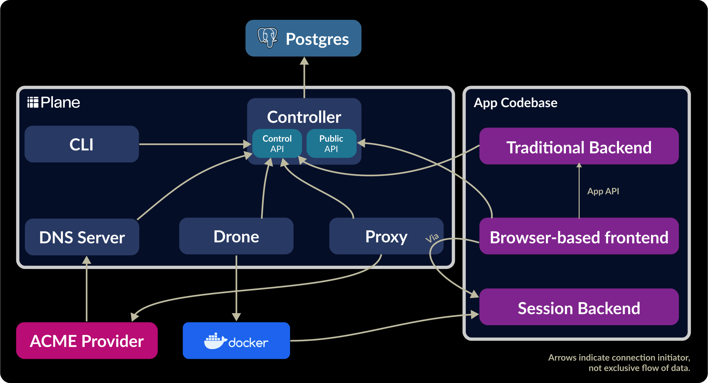

**Note:** This branch is an in-progress rewrite of Plane! Please poke around, but don’t use it in production yet, and don’t be surprised if documentation is missing or inconsistent.

<div style="postion: relative; width: 337px; height: 110px;">
    <a href="https://plane.dev#gh-light-mode-only" style="position: absolute;">
        
    </a>
    <a href="https://plane.dev#gh-dark-mode-only" style="position: absolute;">
        
    </a>
</div>

[](https://hub.docker.com/r/plane/plane-preview/tags)
[](https://github.com/drifting-in-space/plane/actions/workflows/plane-build-image.yml)
[](https://github.com/drifting-in-space/plane/actions/workflows/plane-tests.yml)

Plane is a distributed system for **running stateful WebSocket backends at scale**. Plane is heavily inspired by [Figma’s mulitplayer infrastructure](https://www.figma.com/blog/rust-in-production-at-figma/), which dynamically spawns a process for each active document.

Use cases include:
- Scaling up [authoritative multiplayer backends](https://driftingin.space/posts/you-might-not-need-a-crdt).
- Running isolated code environments (like REPLs, code notebooks, and LLM agent sandboxes).
- Data-intensive applications that need a dedicated high-RAM process for each active user session.

## How Plane works

You can think of Plane as a distributed hashmap, but instead of storing data, it stores running processes. When you ask Plane for the process associated with a key (via an HTTP API), it either returns a URL to an existing process, or starts a new process and returns a URL to that.

Plane will keep the process running for as long as there is an open connection (usually a WebSocket connection) to it. Once all connections to a process have been closed for some time threshold, Plane will shut down the process.

Plane guarantees that only one process will be running for each key at any given time, allowing that process to act as an authoritative source of document state for as long as it is running.

### Architecture

Read more about [Plane’s architecture](https://plane.dev/concepts/architecture).

[](https://plane.dev/concepts/architecture)

## Example

Imagine a multiplayer document editor. When Sam opens a document with ID `abc123`, the application requests a process from Plane with that key. In this case no process is running, so Plane starts a new one.

When Jane opens the *same* document, the application requests a process from Plane with the same key (`abc123`). This time Plane already has a process running for that key, so it returns a URL which maps to that process.

As long as either Jane or Sam has document `abc123` open, Plane will keep the process associated with that document running. After **both** Jane and Sam have closed the document, Plane will shut down the process.

If Carl later opens the same document, Plane will start a _new_ process for him, possibly on a different machine.

## Quick Start

This repo includes a Docker Compose file that is suitable for running a local development instance of Plane.

This works on Linux and Mac systems with Docker installed.

In the root of this repo, run:

```bash
docker compose -f docker/docker-compose.yml up
```

This tells Docker to run a Postgres database, as well as a minimal Plane stack: one controller, one drone, and one proxy (see below for an explanation).

The Plane Controller will be available at http://localhost:8080, and the Plane Proxy will be available at http://localhost:9090.

### Connecting to a process

The `dev/cli.sh` script runs the Plane CLI, configured to connect to the local Plane Controller.

```bash
dev/cli.sh connect \
    --wait \
    --cluster 'localhost:9090' \
    --image ghcr.io/drifting-in-space/demo-image-drop-four
```

## Running tests

Tests can be run with `cargo test`, but it can be slow because it does not run tests in parallel and some of the tests are slow.

You can use `nextest` to run tests in parallel:

```bash
cargo install nextest
cargo nextest run -j 5
```

The `-j 5` flag tells `nextest` to run 5 tests in parallel. If you set it too high, you may encounter Docker issues.
